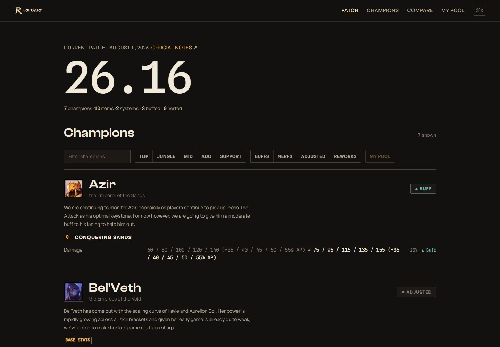

<p align="center">
  
</p>

<h3 align="center">The patch notes, diffed.</h3>

RiftScry turns Riot's prose League of Legends patch notes into structured before → after
changes for the champions you actually play. No account, no backend, no tracking — a
static site whose entire dataset lives in this repository as reviewable JSON.



## Run it

```bash
pnpm install
pnpm dev
```

`pnpm build` emits a fully static site to `dist/` — deployable to Cloudflare Pages (build
command `pnpm build`, output directory `dist`) or any static host.

## How it works

Official Riot patch notes → parsed into normalized, schema-validated JSON
(`src/data/patches/*.json`, one file per patch, committed to git) → Astro builds every
page at compile time. Champion pool personalization is `localStorage` only.

- [Architecture](docs/ARCHITECTURE.md) — pipeline, build, islands, why-static
- [Data & methodology](docs/DATA.md) — schema, deterministic buff/nerf classification, provenance
- [Contributing](CONTRIBUTING.md) — fix a patch with a five-line PR

## Commands

| Command | What it does |
|---|---|
| `pnpm dev` | Dev server |
| `pnpm build` | Static production build |
| `pnpm test` | Unit tests + schema validation of all committed patch data |
| `pnpm e2e` | Playwright end-to-end suite (build first) |
| `pnpm ingest 26.17` | Ingest a patch from the official notes |
| `pnpm ingest --validate` | Re-validate committed patch files (offline) |

## Legal

RiftScry is not endorsed by Riot Games and does not reflect the views or opinions of Riot
Games or anyone officially involved in producing or managing Riot Games properties. Riot
Games and League of Legends are trademarks or registered trademarks of Riot Games, Inc.
Champion imagery via Riot's [Data Dragon](https://developer.riotgames.com/docs/lol#data-dragon).
Code is [MIT](LICENSE); normalized patch data derives from Riot's official patch notes,
with a source link recorded in every patch file.
